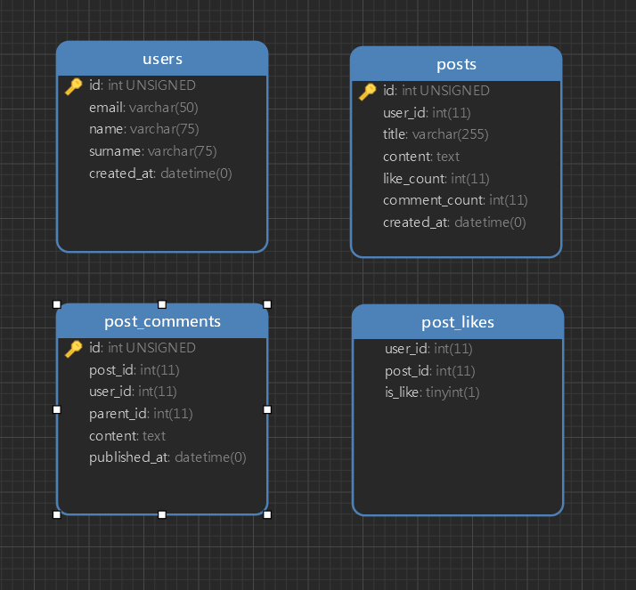

# **Bringit Task Answers**

## **Task-1**

 * How it works?
 * To solve this problem I calculate length and sum of array
 * I use "sum of first n-1 numbers" ===> ((n-1) * n/2)
 * By using this formula I only find missing element, it means it is duplicated number
 
<pre><code> function find_duplicate(array $numbers, $length)
 {
     $sum = 0;
     for ($i = 0; $i<$length; $i++){
         $sum += $numbers[$i];
     }
     return $sum - ((($length - 1) * $length) / 2);
 }</code></pre>
 

## **Task-2**

## **Task-3**

##### DB SCHEMA

I use `WHERE IN` instead on `JOIN`. Because multiple joins show slow performance

Get last 5 posts  
`select * from posts order by id desc limit 5` (example: it returns 1,2,3,4,5)

Get comments of posts  
``select * from post_comments where post_comments.post_id in (1,2,3,4,5)``

Get post with likes of each user
<code><pre>
SELECT users.*, 
    post_likes.post_id, 
    post_likes.user_id 
FROM users 
     INNER JOIN post_likes 
             ON users.id = post_likes.user_id 
WHERE  post_likes.post_id IN ( 1, 2, 3, 4, 5 )
    </pre></code>

